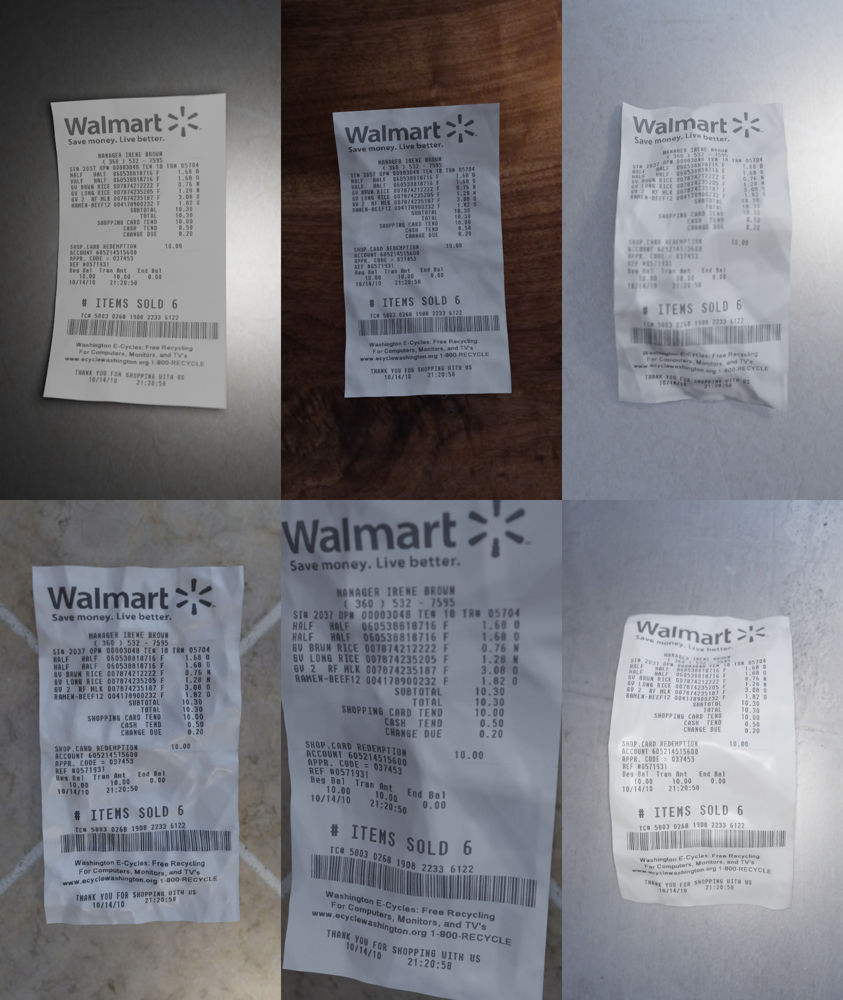

# Receipt Testcase Generator

An simple framework for generating images of fake receipts in different
degenerate scenarios.  This is part of my application to
[Metabrite](https://www.metabrite.com/).  I imagine this is probably similar to
something they already have for their automated testing environment, to test the
accuracy of the CV text extraction code.

The framework randomizes the following attributes within acceptable parameters
to produce a realistic phone photographs:

* Receipt crinkliness
* Receipt curvature
* Receipt alignment with camera
* Receipt ink fadedness
* Receipt paper glossiness
* Table material
* Camera flash
* Camera location
* Camera direction
* Camera exposure
* Camera focal distance
* Camera aperature size
* Environment ambient brightness
* Primary light location

## Sample Renders



## Running

First build the docker image:

`./build.sh`

This produces the image `amoffat/receipts`

Run container and generate receipts using the `generate_receipts.sh` command.
Renders will be output in the `./renders` directory.

```
usage: generate_receipts.sh [-h] [-f NUM] [-s WxH]

optional arguments:
  -h, --help            show this help message and exit
  -f NUM, --frames NUM  The number of frames to render
  -s WxH, --size WxH    Size of the rendered output
```

### Example

`./generate_receipts.sh --size 540x960 --frames 3`

## Improvements

### Programmatic receipt scans
The receipt is currently hardcoded to use the Walmart scanned receipt.  It would
be trivial to add a scan image as a parameter to the `generate_receipts.sh`
script.

### GPU renders
When renders are produced through docker, Blender uses the CPU.  Using the GPU
is less than trivial, but certainly doable, and would speed up docker renders by
about 10x.

### Programmatic variable limits and distributions
The upper and lower limits of the variables we randomly tweak in the scene are
hardcoded in `receipts.py`.  Ideally, we should be able to pass in a JSON
document describing the upper and lower bounds of these adjustments, along with
a distribution function (some vars perform better with triangular distributions,
and other with uniform distributions).
